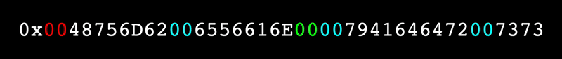

# `Pr000xy`



[](https://travis-ci.org/0age/Pr000xy)
[](https://github.com/RichardLitt/standard-readme)

> `Pr000xy` - a public utility ERC20 for creating & claiming transparent proxies with gas-efficient addresses (i.e. with extra zero bytes) as well as with custom vanity addresses.

[`Pr000xy`](https://github.com/0age/Pr000xy/blob/master/contracts/Pr000xy.sol) is a public utility ERC20 for creating & claiming [transparent proxies](https://blog.zeppelinos.org/the-transparent-proxy-pattern/) with gas-efficient addresses. Tokens are minted when specific salts or nonces are submitted that result in the creation of new proxies with more zero bytes than usual. They are then burned when transferring ownership of those proxies from the contract to the claimer. `Pr000xy` also allows for offers to be placed on matching proxy addresses to a set of conditions (i.e. finding custom vanity addresses). For creating *arbitrary* contracts with gas-efficient addresses yourself, you can use [Create2Factory](https://github.com/0age/Pr000xy/blob/master/contracts/Create2Factory.sol).

**DISCLAIMER: DO NOT HODL THIS TOKEN! `Pr000xy` may *technically* be an ERC20 token, but makes for a TERRIBLE "investment" for a whole bunch of reasons, such as:**
* The **code is unaudited, mostly untested, and highly experimental**, and so **should not be considered secure** by any measure (this goes for placing offers as well - don't put up any offer that you're not prepared to lose),
* The token itself is **highly deflationary**, meaning that it will **almost certainly decrease in value** as address mining becomes more efficient,
* The token's value will be **highly volatile** and **total supply will fluctuate greatly**, as creation of new, comparatively rare addresses will issue a massive number of tokens at once,
* The token will be **vulnerable to "shadow mining"**, where miners can wait to submit discovered addresses and instead submit a large group all at once, making it a target for manipulation,
* The **token contract itself will likely become obsolete** as better methods for discovering CREATE2 addresses become available (including GPU mining and ASICs) and new versions or competing solutions come online... and no, there will be **no way to "convert your tokens to the new version"**, because
* There's **no organization, group, collective, or whatever backing the tokens**, and they're **not a claim on any asset, voting right, share, or anything at all** except for that they can be burned in order to take ownership of an unclaimed upgradeable proxy of equivalent value.

**TO REITERATE: this is an experiment and should NOT be considered an investment of any kind! There is no ICO or token sale - don't be a giver-of-ETH to a scammer.**

More details, including a derivation of the value of each address based on rarity and examples of how gas-efficient addresses can be put to use, can be found [here](https://medium.com/@0age/on-efficient-ethereum-addresses-3fef0596e263).

`Pr000xy` on Ropsten: [0x000000009a9fc3ac5280bA0D3eA852E57DD2ac1b](https://ropsten.etherscan.io/address/0x000000009a9fc3ac5280ba0d3ea852e57dd2ac1b) (Solidity 0.5.1, 33333 optimization runs)
`Create2Factory` on Ropsten: [0xa779284f095ef2eBb8ee26cd8384e49C57b26996](https://ropsten.etherscan.io/address/0xa779284f095ef2eBb8ee26cd8384e49C57b26996)

## Table of Contents

- [Install](#install)
- [Usage](#usage)
- [API](#api)
- [Maintainers](#maintainers)
- [Contribute](#contribute)
- [License](#license)

## Install
To install Pr000xy locally, you'll need Node.js 10+, Yarn *(or npm)*, and Docker *(which runs geth in "dev" mode - you can also run geth directly or use another Constantinople-compatible testRPC)*. To get everything set up:
```sh
$ git clone https://github.com/0age/Pr000xy.git
$ cd Pr000xy
$ yarn install
$ docker pull ethereum/client-go
$ yarn build
```

## Usage
In a new terminal window, start the testRPC, run tests, and tear down the testRPC *(you can do all of this at once via* `yarn all` *if you prefer)*:
```sh
$ yarn start
$ yarn test
$ yarn linter
$ yarn verify # check contract source code against Ropsten contract
$ yarn stop
```


## API

See [`Pr000xyInterface.sol`](https://github.com/0age/Pr000xy/blob/master/contracts/Pr000xyInterface.sol).

## Maintainers

[@0age](https://github.com/0age)

## Contribute

PRs accepted gladly - make sure the tests and linters pass.

## License

MIT © 2019 0age
